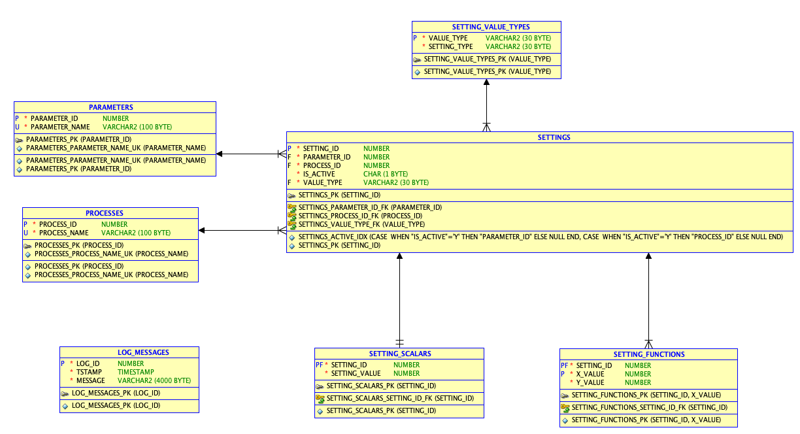
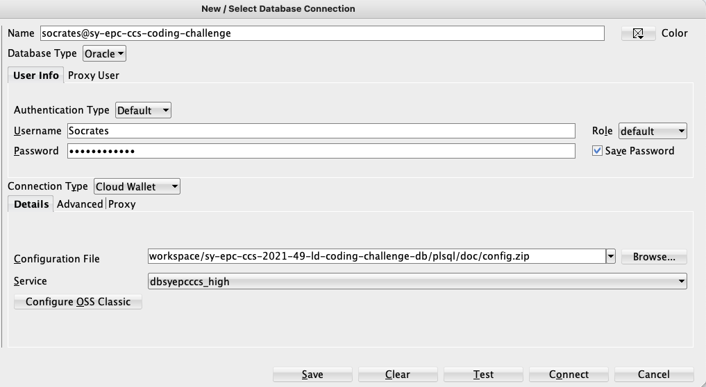

# The Control System Settings Database

### Context

You joined a new team as database engineer. The team is working with machine controls and asks you to analyse and improve their existing controls system settings database.

### Problem

You inherited a settings management module of the control system that was left by the previous maintainer with little documentation. You were told that its task is to store settings of a large number of parameters, grouped by the processes those settings apply to. The system stores the whole history of settings, meaning they are never deleted. There can be only one "active" setting per parameter for each process. The module relies on the logic stored in the database to create, retrieve, and transform the settings, while the schema takes care of the coherency of data through a number of relational constraints.

Your task is to analyse the module, identify its weaknesses, and propose or implement the solutions, as enumerated in the list of the tasks below.

The schema of the database is available in `00-setup-00-ddl.sql`. It is also represented visually below:

The database relies on PL/SQL functions and procedures specified in `01-code-00-init-00.sql`.
### Development setup

In order to ease your debugging, we recommend to use the [Oracle Cloud service](https://www.oracle.com/cloud/free/) when working on this challenge. For this purpose, we did set up one Oracle Cloud database instance for each candidate. Your personal connection details and credentials should be included in the coding challenge invitation e-mail.

To work on your database instance, you can either use the web IDE provided by Oracle Cloud or you can connect with a local SQLDeveloper installation. Although you can solve the challenge via the web IDE, we recommend to use the latter approach as it gives you a better control over the PL/SQL code.

In order to connect to your database instance via SQLDeveloper, you will need to define a connection of type 'Cloud PDB' or 'Cloud Wallet', use your personal credentials and use this [configuration file](./doc/config.zip).

Example configuration for connecting with SQLDeveloper:

(screenshot taken with SQLDeveloper v19.2.1.247 on macOS 11.4)

Once you have set up the connection, you can set up your database content via executing the provided sql files in this order:

1. `00-setup-00-ddl.sql`: To create tables, sequences, etc.
2. `01-code-00-init-00.sql`: To create PL/SQL functions and procedures
3. `02-data.sql`: To populate the tables with data

You should then be ready to work on the tasks below.

### Tasks

1. Analyse the existing DB schema including the PL/SQL functions and procedures and verbally describe what they do by adding comments to the code.

2. Identify general issues, caveats and weaknesses present in the provided code and verbally propose improvements. This may include but not be limited to error handling and PL/SQL coding best practices. Please write down your findings in the `comments.txt` file.

3. Consider that in a production system you have to deal with millions of settings. Identify the potential performance issues in the code. Please explain your reasoning in the `comments.txt` file.

4. Introduce a constraint such that only one setting per parameter/process combo can be active (is_active = 'Y'), with no limitation on the number of non-active settings.

5. Transform individual functions and procedures into package(s).

6. Implement error handling for the procedure "copy_settings".

7. Make sure that the actions are logged into the log_messages table even if the data manipulation fails and the transaction needs to be rolled back.

8. Implement a routine to query all settings for a given parameter/process, regardless of the underlying value type. Take into account that the volume of data returned can be very large.

### Deliverable
Please provide us with `.sql` files that incorporate your changes and with the `comments.txt` that contains your reasoning for the analysis and the proposed improvements.

You are free to modify the content of any of the existing `.sql` files (`00-setup`, `01-code`, `02-data`) but you can also introduce new `.sql` files if you think this is necessary. If you create new files, please specify the global order of execution via a number prefix (`00-`, `01-`, ...). You can add comments wherever you think it is appropriate or wherever you are asked to explain your reasoning.

The `.sql` files submitted by you should be executable on an empty database instance without errors.

### Ranking

Your answers will be evaluated on the following points (from most important to least important):
- Correctness and completeness
- Clarity of the code and comments relevance
